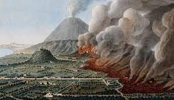

# Mar erupts in europe
* M stands for militarism
* A = alliance
* I = imperialism
* N= nationalism
* Triple alliance
* Triple entree

# Keys for war preparations
* An and woman power
* Food and supplies
* Military supplies and transportation
* How to pay for it all
* Selective service act. 

# The challenge in declaring wark 
* Yellow journalism  
* president william mckinley 
* ‘Remember the maine’
* Final attempt to avoid war.  
* Frontier thesis  

Izac Carmona
Period 6

