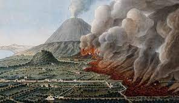

# Turn, mahan and the plan for the empire
* Fredrick jackson turner
* Fredrick jackson turner
* Alfred  thayer mahan
* The influence of seaport upon history. 

# Struggles of settling
* An and woman power
* Day in the life
* Debt concerns 
* Bonanza farms
* Life of women

#  Immigration
* Urbanization
* Industrialization 
