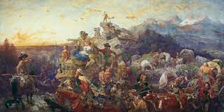

# The “Manifested West
<!-- Bullet points -->
* Economic opportunities 
* Economic panic of 1837
* Manifest Destiny’s unexpected reach and uses
* Wagons westward

* Common tropes
* “What's in it for me?” -  Homestead act and Pacific Railway Act
* Union Pacific - E → W
* Union Pacific - E → W
<!-- End bullet points -->

---------------

# The settlers Themselves 
* Crossing by Railway
* Easier than ever to settle
* Incentives for settlers
* More effects of the Transcontinenta
*  Birds of a feather flock together
* Ideal opportunity for the people for the government 
<!-- Start Image -->